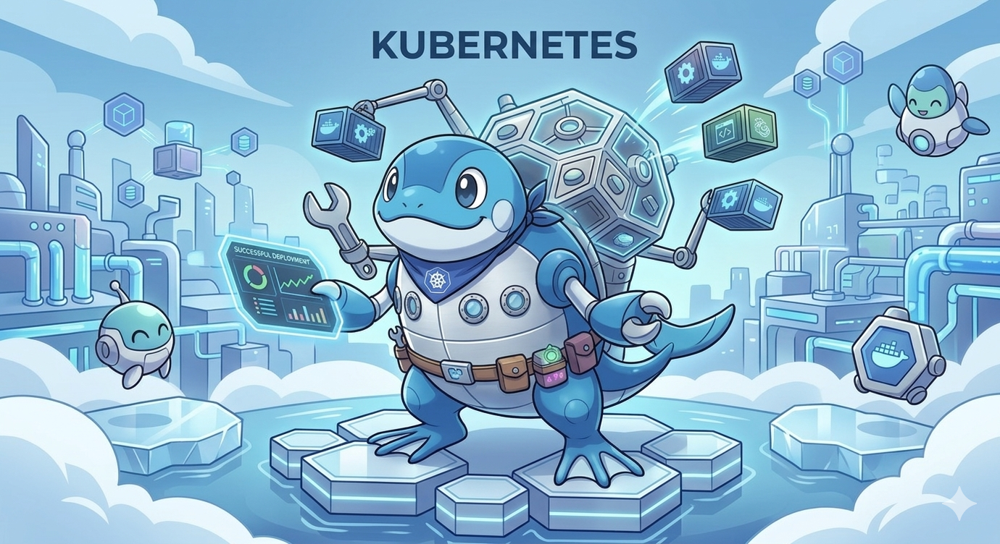
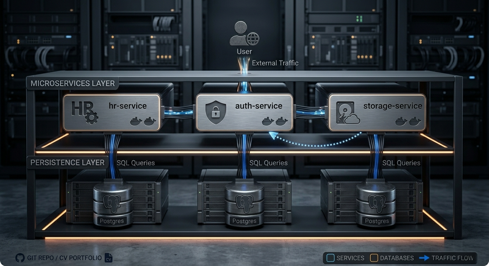
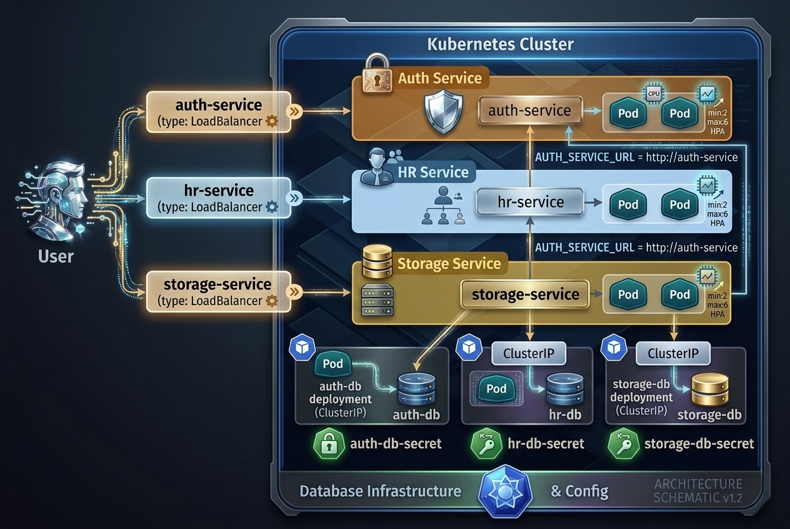

# k8s-infra

<p>
  
</p>

A Kubernetes-based microservices infrastructure demonstrating service-to-service communication, horizontal pod autoscaling, and containerised deployment with dedicated PostgreSQL databases per service.

## Table of Contents

- [About The Project](#about-the-project)
  - [Architecture](#architecture)
  - [Built With](#built-with)
- [Getting Started](#getting-started)
  - [Prerequisites](#prerequisites)
  - [Installation](#installation)
- [Usage](#usage)
- [Project Structure](#project-structure)

---

## About The Project

This project sets up three Node.js microservices (`auth`, `hr`, `storage`) on a local Kubernetes cluster (Minikube). Each service runs in its own Deployment with a dedicated PostgreSQL database, Kubernetes Secrets for credentials, liveness/readiness probes, and a HorizontalPodAutoscaler.

The `hr` and `storage` services authenticate requests by calling the `auth` service internally via Kubernetes DNS (`http://auth-service`).

### Architecture

<p>
  
</p>

Each microservice exposes a `/healthz` health-check endpoint used by Kubernetes probes, and each Deployment is backed by a HorizontalPodAutoscaler (min 2 / max 5–6 replicas, CPU target 50%).

### Built With

- [](https://nodejs.org/)
- [](https://expressjs.com/)
- [](https://www.postgresql.org/)
- [](https://www.docker.com/)
- [](https://kubernetes.io/)
- [](https://minikube.sigs.k8s.io/)

---

## Getting Started

### Prerequisites

- [Docker](https://docs.docker.com/get-docker/) installed and running
- [Minikube](https://minikube.sigs.k8s.io/docs/start/) installed
- [kubectl](https://kubernetes.io/docs/tasks/tools/) installed

```sh
# Verify installations
docker --version
minikube version
kubectl version --client
```

### Installation

1. **Clone the repository**

   ```sh
   git clone https://github.com/KovyD20/k8s-infra.git
   cd k8s-infra
   ```

2. **Start Minikube**

   ```sh
   minikube start
   ```

3. **Point your shell to Minikube's Docker daemon**

   This allows Kubernetes to use locally built images without pushing to a registry.

   ```sh
   # Linux / macOS
   eval $(minikube docker-env)

   # Windows PowerShell
   & minikube -p minikube docker-env --shell powershell | Invoke-Expression
   ```

4. **Build the Docker images inside Minikube**

   ```sh
   docker build -t auth:latest ./auth
   docker build -t hr:latest ./hr
   docker build -t storage:latest ./storage
   ```

5. **Apply Kubernetes Secrets**

   ```sh
   kubectl apply -f auth-db-secret.yaml
   kubectl apply -f hr-db-secret.yaml
   kubectl apply -f storage-db-secret.yaml
   ```

6. **Deploy all services**

   ```sh
   kubectl apply -f auth.yaml
   kubectl apply -f hr.yaml
   kubectl apply -f storage.yaml
   ```

7. **Verify everything is running**

   ```sh
   kubectl get pods
   kubectl get services
   kubectl get hpa
   ```

   All pods should reach `Running` status within about 30 seconds.

---

## Usage

Use `minikube service` to open each LoadBalancer service:

```sh
# Auth service
minikube service auth-service

# HR service (calls auth internally)
minikube service hr-service

# Storage service (calls auth internally)
minikube service storage-service
```

### Available endpoints

| Service | Endpoint     | Description                              |
|---------|--------------|------------------------------------------|
| auth    | `GET /`      | Hello World                              |
| auth    | `GET /healthz` | Liveness / readiness probe             |
| auth    | `GET /auth`  | Returns `{ auth: "ok" }`                 |
| hr      | `GET /healthz` | Liveness / readiness probe             |
| hr      | `GET /hr`    | Calls auth-service, returns `{ hr: "ok", auth: { auth: "ok" } }` |
| storage | `GET /healthz` | Liveness / readiness probe             |
| storage | `GET /storage` | Calls auth-service, returns `{ storage: "ok", auth: { auth: "ok" } }` |

### Teardown

```sh
kubectl delete -f auth.yaml -f hr.yaml -f storage.yaml
kubectl delete -f auth-db-secret.yaml -f hr-db-secret.yaml -f storage-db-secret.yaml
minikube stop
```

---

## Project Structure

<p>
  
</p>

Each `*.yaml` manifest contains:
- A **Deployment** for the Node.js service (2 replicas, resource limits, probes)
- A **LoadBalancer Service** exposing the app on port 80
- A **Deployment** for the dedicated PostgreSQL 15.3 database
- A **ClusterIP Service** for internal DB access on port 5432
- A **HorizontalPodAutoscaler** scaling on CPU utilisation (target 50%)

## Contact

Kövy Dániel - (Daniel Koevy) 

GitHub: https://github.com/KovyD20

LinkedIn: <https://www.linkedin.com/in/d%C3%A1niel-k%C3%B6vy-62129b324/>

E-mail: kovy.d20@gmail.com

